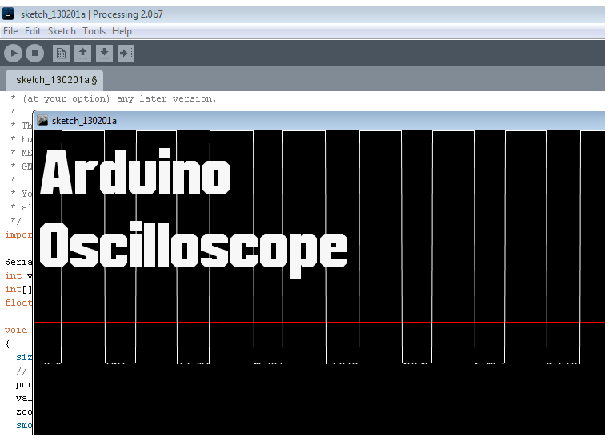

## Arduino: el osciloscopio del pobre

¿Alguna vez has querido utilizar un osciloscopio pero no puedes permitirte uno? ¡No te preocupes! Con Arduino, el osciloscopio del pobre, podrás crear tu propio dispositivo de monitoreo de señales electrónicas de forma económica y sencilla. Descubre en este artículo cómo puedes aprovechar al máximo esta plataforma de código abierto para tus proyectos electrónicos. ¡No te lo pierdas!

¡Hoy estoy hablando de un proyecto realmente bueno que puedes hacer con tu Arduino! Esta es la mejor manera de tener a mano un osciloscopio barato. 

Primero, descargue Processing. No necesitas instalar nada, se ejecuta como el IDE de Arduino.

##  Sube este código a tu Arduino

#define ANALOG_IN 0
 
void setup() {
  Serial.begin(9600); 
  //Serial.begin(115200); 
}
 
void loop() {
  int val = analogRead(ANALOG_IN);                                              
  Serial.write( 0xff );                                                         
  Serial.write( (val >> 8) & 0xff );                                            
  Serial.write( val & 0xff );
}

## Luego ejecute este código en el IDE de procesamiento.

import processing.serial.*;
 
Serial port;  // Create object from Serial class
int val;      // Data received from the serial port
int[] values;
float zoom;
 
void setup() 
{
  size(1280, 480);
  // Open the port that the board is connected to and use the same speed (9600 bps)
  port = new Serial(this, Serial.list()[0], 9600);
  values = new int[width];
  zoom = 1.0f;
  smooth();
}
 
int getY(int val) {
  return (int)(height - val / 1023.0f * (height - 1));
}
 
int getValue() {
  int value = -1;
  while (port.available() >= 3) {
    if (port.read() == 0xff) {
      value = (port.read() << 8) | (port.read());
    }
  }
  return value;
}
 
void pushValue(int value) {
  for (int i=0; i < width-1; i++)
    values[i] = values[i+1];
  values[width-1] = value;
}
 
void drawLines() {
  stroke(255);
  
  int displayWidth = (int) (width / zoom);
  
  int k = values.length - displayWidth;
  
  int x0 = 0;
  int y0 = getY(values[k]);
  for (int i=1; i < displayWidth; i++) {
    k++;
    int x1 = (int) (i * (width-1) / (displayWidth-1));
    int y1 = getY(values[k]);
    line(x0, y0, x1, y1);
    x0 = x1;
    y0 = y1;
  }
}
<code> 
void drawGrid() {
  stroke(255, 0, 0);
  line(0, height/2, width, height/2);
}
 
void keyReleased() {
  switch (key) {
    case '+':
      zoom *= 2.0f;
      println(zoom);
      if ( (int) (width / zoom) <= 1 )
        zoom /= 2.0f;
      break;
    case '-':
      zoom /= 2.0f;
      if (zoom < code 1.0f)
        zoom *= 2.0f;
      break;
  }
}
 
void draw()
{
  background(0);
  drawGrid();
  val = getValue();
  if (val != -1) {
    pushValue(val);
  }
  drawLines();
}
</code>

## Piezas requeridas

- Arduino UNO – leer Los mejores kits de inicio de Arduino
-  placa de pruebas
- 1xLED
- 1x resistencia de 10k
- Resistencia de 1 × 4,7k
- 1x resistencia de 1k
- 1 condensador electrolítico de 100 nF.
- Cables de puente